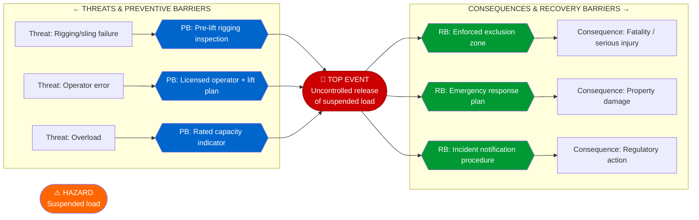
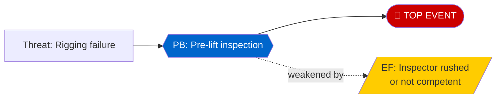

# Mermaid diagram template for bow ties

Mermaid has no native bow tie layout, but a **left-right flowchart** renders one well — preventive
barriers on the left, the top event in the centre, recovery (mitigating) barriers on the right.
Portable: works in any Markdown renderer that supports Mermaid, and can be exported to an image for
a Word document or report. The table in `bowtie-methodology.md` remains the source of truth; this is
the picture.

## Basic structure

## Colour conventions

| Colour | Meaning |
|---|---|
| 🟠 Orange | Hazard |
| 🔴 Red | Top event |
| 🔵 Blue | Preventive barrier |
| 🟢 Green | Recovery (mitigating) barrier |
| White / default | Threat or consequence |

## Showing escalation factors

Branch an escalation-factor node off the barrier it weakens:

## Tips

- Keep it readable — at most **4–5 threats and 4–5 consequences** in one diagram. For complex
  hazards, split into one diagram per consequence cluster (Format C in `bowtie-methodology.md`).
- In a Word document, export the rendered diagram as an image and embed it.
- In Markdown/README, use the Mermaid code block directly.
- Flag **critical controls** distinctly (e.g. a thicker stroke) so the few load-bearing barriers
  stand out from the supporting ones.
